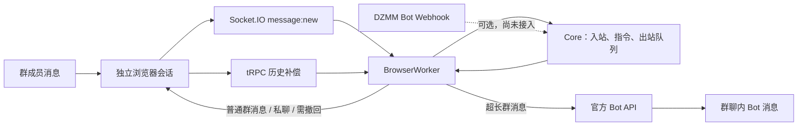

# DZMM 消息收发、长消息与官方 Bot 交接手册

> 适用范围：当前 DZMM 群机器人。本文只记录已经验证的实现、平台调用形式和交接步骤；所有 `<...>` 均为占位符，**不得填入或提交真实 Token、Cookie、Webhook Secret、用户 ID、Bot ID 或群聊 ID**。

## 1. 交接结论

当前系统有两条互补的消息发送路径，以及一条浏览器入站读取路径：

| 场景 | 使用身份 | 当前实现 | 说明 |
| --- | --- | --- | --- |
| 接收群消息、接收已存在的一对一私聊、普通群消息发送、撤回 | 已登录的普通 DZMM 账号 | 浏览器会话 + Socket.IO + 历史补偿 | 这是游戏/指令的主收发通道。 |
| 超长群回复 | 自建官方 Bot | `POST /api/bot/send-message` | 用于规避普通账号的 1,000 字符/10 个换行限制。 |
| Bot Webhook 回调 | 自建官方 Bot | 平台可投递；**当前应用未接入** | 未来可作为独立入站通道，不应和浏览器读取同时重复处理同一条消息。 |



关键边界：

- **普通账号**不是 Bot，不能通过伪造消息字段获得 Bot 长消息权限。
- 官方 Bot API 仅用于当前目标群的长消息；私聊、需要撤回的消息仍走浏览器账号。
- Webhook 是“平台主动推送给本服务”的接收通道，不是发送 API，也不是当前运行中 BrowserWorker 的必需项。
- 启用 Webhook 前必须先完成去重与职责切换设计；否则同一群消息会被浏览器和 Webhook 各处理一次。

## 2. 当前代码与配置入口

| 位置 | 职责 |
| --- | --- |
| `src/dzmm_bot/browser/aikda_socket.py` | Socket.IO 连接、`message:new` 接收、每 5 秒历史补偿、普通消息发送/撤回、已存在私聊发现。 |
| `src/dzmm_bot/browser/session.py` | 保持隔离浏览器用户目录、取网页 Token/Cookie、调用 tRPC、启动或接管浏览器。 |
| `src/dzmm_bot/browser/worker.py` | 入站提交、出站租约确认、短/长消息路由、私聊同步。 |
| `src/dzmm_bot/browser/bot_api.py` | 官方 Bot API 的最小发送客户端。 |
| `src/dzmm_bot/runtime/outbound.py` | 长消息阈值：`>1000` 字符或 `>10` 个 `\n`。 |
| `src/dzmm_bot/browser/main.py` | 从环境变量创建 BrowserWorker 和可选 Bot Sender。 |
| `deploy/env/dzmm.example.env` | 生产环境变量样例。 |
| `tests/browser/test_aikda_socket.py` | 浏览器 Socket/历史/普通发送/私聊/撤回覆盖。 |
| `tests/browser/test_bot_api.py` | 官方 Bot API 请求、认证头、响应校验覆盖。 |
| `tests/browser/test_worker.py` | 短/长消息路由、私聊与撤回排除规则覆盖。 |

生产机的密钥只应放入服务的受限环境文件，例如 `/etc/dzmm/dzmm.env`；不要放入仓库的 `.env`、文档或聊天记录。

## 3. 必要配置

以下变量由 BrowserWorker 使用：

```dotenv
# PostgreSQL/Core 的现有配置
DZMM_DATABASE_URL=<...>
DZMM_CORE_TOKEN=<...>

# 普通账号浏览器通道
DZMM_BROWSER_PROFILE=/var/lib/dzmm-browser/profile
DZMM_LOGIN_URL=https://www.aikda.com/sign-in
DZMM_CHAT_URL=https://www.aikda.com/chat?c=<TARGET_GROUP_CHATROOM_ID>

# 可选：官方 Bot 长消息通道
DZMM_BOT_API_TOKEN=<BOT_API_TOKEN>
```

配置要求：

1. `DZMM_BROWSER_PROFILE` 必须是机器人专用、可持久化的浏览器目录。不要与运营者的个人浏览器共用。
2. `DZMM_CHAT_URL` 必须含 `c=<chatroom_id>`；Worker 从这里提取目标群 ID，供 Bot API 发送长消息使用。
3. `DZMM_BOT_API_TOKEN` 留空时，系统不会创建 Bot Sender，所有消息仍由浏览器账号发送。
4. 配置 Bot Token 后，目标 Bot 必须已安装进 `DZMM_CHAT_URL` 对应的群，否则官方 API 会拒绝发送。
5. 修改环境变量后重启 Browser Worker，再做消息收发冒烟测试。

## 4. 普通账号：接收、发送、撤回

### 4.1 登录与会话

普通账号通过隔离浏览器用户目录保持登录态。启动流程如下：

```text
BrowserSession.start_headless()
→ 打开/恢复专用 Profile
→ 从 /api/auth/token 获取 Socket.IO Token
→ 从当前页面取 Cookie
→ 连接目标群所在站点
```

当登录失效或人机验证页出现时，不能只看数据库中历史 `Ready` 状态；需要用管理端的“人工登录”流程完成账号验证，之后恢复 Worker。登录状态、读消息、发消息均依赖这个 Profile。

### 4.2 接收机制

`AikdaSocketGateway.read_new()` 有两层保障：

1. 监听 Socket.IO 事件 `message:new`，实时接收目标群文本消息；
2. 每 5 秒调用 `chatroom.getMessages` 做历史补偿，避免临时断线、页面切换或 Socket 事件缺失造成漏消息。

入站过滤规则：

- 只接受 `DZMM_CHAT_URL` 对应群的消息；
- 忽略普通账号自身发送的消息，防止机器人自触发；
- 只处理 `content.type == "text"` 且含有效消息 ID、发送者 ID、发送时间的消息；
- 以平台 `message_id` 去重，再提交给 Core。

**一对一私聊**：Worker 每 30 秒读取 `chat.listAll`，筛选 `chatType == "one_on_one"`，再通过该房间历史中第一条非机器人消息的 `sent_by` 识别对方用户，登记为可发送的私聊房间。机器人不能凭用户 ID 任意创建或发现尚未建立、且机器人无权访问的私聊。

### 4.3 普通发送

普通群消息和已登记私聊均使用 Socket.IO：

```text
message:join-room({ chatroomId })
→ message:send({ chatroomId, message })
→ 服务端 ACK { success: true }
```

核心消息字段为：

```json
{
  "chatroomId": "<CHATROOM_ID>",
  "message": {
    "message_id": "<UUID>",
    "sent_by": "<CURRENT_BROWSER_ACCOUNT_ID>",
    "chatroom_id": "<CHATROOM_ID>",
    "sent_at": "<UTC_ISO_TIME>",
    "content": { "type": "text", "text": "<TEXT>" }
  }
}
```

不要修改 `sent_by`、`isBot`、`metadata.role` 等字段伪造身份。普通账号服务端当前受群限制约束：

- 最多 1,000 字符；
- 最多 10 个换行符；
- 还有重复内容和短时频率校验。

如果 ACK 拒绝，应以 Core 出站状态和 Worker 日志排查；不要盲目在失败后立即走另一条通道重发，否则可能重复投递。

### 4.4 撤回

撤回只走普通账号 Socket 通道：

```text
message:recall({ chatroomId, messageId })
```

因此需要撤回的消息不得路由到官方 Bot API。平台对可撤回主体和时限有约束；实施新玩法时必须将撤回消息的 `platform_message_id` 持久化，并在时限内发起撤回。

## 5. 官方 Bot：创建、安装与管理

### 5.1 身份模型

Bot 不是另一个网页登录账号：

```text
运营者普通账号：登录 DZMM 管理 Bot
Bot 程序：使用 API Token 调用官方 API
目标群：Bot 作为独立群成员发言
```

观察到的管理入口为：

```text
https://www.dzmm.ai/studio/bots
```

页面和域名可能随平台演进调整；优先使用 Bot 管理页面完成创建、令牌查看/轮换、Webhook URL 和可见性修改。

### 5.2 推荐创建步骤（优先 UI）

1. 用拥有目标群管理权限的 DZMM 普通账号进入 Bot 管理页；
2. 创建 Bot，填写名称，按用途选择私有或公开；
3. 保存后立即把 API Token 放入生产密钥文件；页面只要提供“重新生成”，就意味着旧 Token 会失效，轮换后务必同步更新服务环境；
4. 保存 Bot ID，作为安装与后续配置的标识；
5. 将 Bot 添加到目标群；
6. 从群成员列表或 Bot 列表确认 Bot 实际在群中；
7. 用专用测试群先发送一条短消息与一条长消息。

已观察到的前端 tRPC procedure（不应替代 UI；平台变更时需要重新抓包确认）是：

```text
developer.listMyBots
developer.createBot({ name, isPublic })
developer.getBot({ botId })
developer.updateBot({ botId, name?, webhookUrl?, isPublic? })
developer.regenerateToken({ botId })
developer.deleteBot({ botId })

chatroom.listBots({ chatroomId })
chatroom.addBot({ chatroomId, botId })
```

### 5.3 安装到群聊

Bot 创建后不会自动进入任何群。优先在群聊 UI 的 Bot/添加成员入口安装；必要时再按已验证的前端调用处理：

```text
chatroom.listBots({ chatroomId })
→ 确认未安装/取得当前状态
→ chatroom.addBot({ chatroomId, botId })
→ 再次 chatroom.listBots({ chatroomId }) 验证
```

安装失败的常见原因：当前普通账号不是群主/管理员、Bot ID 错误、Bot 已安装、群类型不允许或平台端权限策略变化。Bot API 返回 `bot is not installed` 时，应先回到这里排查，而不是更换 Token 重试。

## 6. 官方 Bot 长消息发送

### 6.1 已实现路由规则

`BrowserWorker._send_outbound()` 只有在**全部**满足时才使用官方 Bot：

```text
已设置 DZMM_BOT_API_TOKEN
且可从 DZMM_CHAT_URL 获得目标群 chatroom ID
且这是群消息（delivery_kind == group）
且不是私聊（destination_chatroom_id 为空）
且不需要撤回（recall_after_seconds 为空）
且文本 > 1000 字符，或 \n 数量 > 10
```

其余情况一律保持浏览器 Socket 通道。阈值实现在：

```python
len(text) > 1000 or text.count("\n") > 10
```

注意它按换行字符数而非“视觉行数”判断。

### 6.2 API 约定

当前客户端使用：

```http
POST https://www.dzmm.ai/api/bot/send-message
X-Bot-Token: <BOT_API_TOKEN>
Content-Type: application/json
```

请求体：

```json
{
  "chatroom_id": "<TARGET_GROUP_CHATROOM_ID>",
  "content": "<FULL_TEXT>"
}
```

成功必须同时满足：

```text
HTTP 200
body.ok == true
body.result.message_id 为非空字符串
```

代码中已经对非 JSON、非 200、`ok != true`、缺失 `message_id` 全部抛出发送错误。失败时不自动用普通账号回退发送，因为响应不明确时回退会造成重复消息。

### 6.3 已验证能力与限制

在自建测试群，官方 Bot API 已验证：

- 含 19 个换行符的 20 行消息可以发送；
- 单行 2,000 字符消息可以发送；
- 能收到匹配的 `message:new`，并可用历史接口回读同一 `message_id` 和全文。

这只是已测试规模，并不承诺平台无限长度。上线新上限前应先在测试群做带唯一 marker 的试验。

## 7. Webhook：可选的 Bot 入站通道

### 7.1 当前状态与选择

平台 Bot 设置页支持填写 Webhook URL；平台投递时使用请求头：

```http
X-Telegram-Bot-Api-Secret-Token: <WEBHOOK_SECRET>
```

当前 DZMM 应用**没有 Webhook HTTP endpoint，也没有将 Webhook 入站接入 Core**。现有消息读取继续依赖浏览器 Socket + 历史补偿。这是有意的：在没有幂等与路由职责改造之前，直接同时开启会导致重复处理。

若未来需要让官方 Bot 独立接收消息，可接入，但应该二选一：

- 只让 Webhook 处理 Bot 所在群，而浏览器排除该群；或
- 两者都写入同一个幂等入站入口，并以平台 `message_id` 在数据库建立唯一约束。

### 7.2 Webhook 接入最低要求

1. 提供公网可访问的 **HTTPS** `POST` 地址，例如 `https://<domain>/dzmm/bot/webhook`；
2. 从受限环境变量读取 `DZMM_BOT_WEBHOOK_SECRET`；
3. 使用常量时间比较校验 `X-Telegram-Bot-Api-Secret-Token`；不匹配立即返回 `401`；
4. 限制请求体大小、解析 JSON、记录可定位但不含密钥的错误日志；
5. 从实际 payload 中提取平台 `message_id`，先做持久化幂等检查，再提交到 Core；
6. 即使业务处理稍后异步执行，投递已安全入队时也快速返回成功；
7. 先在测试群保存一份脱敏 payload，再据此写 schema；不要猜测 Webhook JSON 字段。

最小伪代码：

```python
@app.post("/dzmm/bot/webhook")
def dzmm_webhook(request: Request):
    supplied = request.headers.get("X-Telegram-Bot-Api-Secret-Token", "")
    if not hmac.compare_digest(supplied, settings.bot_webhook_secret):
        raise HTTPException(status_code=401)

    update = request.json()  # 先做大小限制与 JSON 错误处理
    message = parse_verified_platform_update(update)  # 按实际抓到的 payload 实现
    if message is not None:
        submit_if_new(platform_message_id=message.id, message=message)
    return {"ok": True}
```

Webhook Secret、Bot API Token 与普通账号 Cookie 是三种不同凭据，均不得互相替代。

## 8. 部署与验收步骤

### 8.1 部署前

1. 确认 `DZMM_BROWSER_PROFILE` 的登录态可用；
2. 确认 `DZMM_CHAT_URL` 是预期目标群；
3. 若启用长消息：确认 Bot Token 已写入受限环境，Bot 已安装到该群；
4. 不要把任何凭据通过 shell 回显、日志或截图输出；
5. 运行聚焦测试：

```bash
.venv/bin/pytest -q \
  tests/browser/test_bot_api.py \
  tests/browser/test_aikda_socket.py \
  tests/browser/test_worker.py
```

### 8.2 重启和状态检查

生产环境修改配置或代码后：

```bash
sudo systemctl restart dzmm-browser-worker.service
sudo systemctl status dzmm-browser-worker.service --no-pager
sudo journalctl -u dzmm-browser-worker.service -n 100 --no-pager
```

服务显示 active 不是全部验收。还要在测试群验证：

1. 用户发一条短指令，确认入站被接受并收到普通账号回复；
2. 发送一条超过阈值的唯一长文本，确认它由 Bot 身份出现；
3. 检查发送 API 的 `message_id` 已被 Core 确认；
4. 用 `chatroom.getMessages` 回读长消息，确认 `message_id`、`sent_by`、`content.type` 和全文；
5. 发送一条私聊或撤回测试，确认仍由普通账号通道处理。

### 8.3 验收标准

| 能力 | 最低通过标准 |
| --- | --- |
| 浏览器入站 | Socket 事件或历史补偿可将一条新文本入站一次，重复拉取不重复入库。 |
| 普通出站 | `message:send` 得到成功 ACK，Core 将消息标记已发送。 |
| 长消息出站 | API 返回 HTTP 200、`ok=true`、非空 `message_id`，并可从群历史回读。 |
| Bot 安装 | Bot 在 `chatroom.listBots` 或群成员 UI 中可见，且 API 可对该群发言。 |
| 私聊 | 仅对机器人已经可访问并同步登记的一对一房间发送。 |
| Webhook（未来） | 错误 Secret 返回 401；同一 `message_id` 重投不会重复执行。 |

## 9. 常见故障排查

| 表现 | 优先检查 | 处理方向 |
| --- | --- | --- |
| 管理端显示 Ready，但机器人不读消息 | Worker 日志、`chatroom.getMessages` 是否有新消息、浏览器是否实际在登录/人机验证页 | 重走人工登录；确认 Worker 重新开始 `read_new()`，不要只依据旧心跳。 |
| 可以发消息，无法读玩家消息 | Socket 连接、目标群 ID、历史补偿、入站去重/Worker 监听状态 | 先验证历史接口有无目标消息，再查 `read_new()` 与 Core 入站记录。 |
| 普通发送被拒绝“过长/换行过多” | 文本长度、`\n` 数、是否配置 Bot Token | 检查是否超过阈值，确认符合条件的群消息已路由至 Bot。 |
| Bot API 返回 `bot is not installed` | Bot 是否在**同一个** `DZMM_CHAT_URL` 群内 | 回到群成员/Bot 管理页安装并复核，不要反复换 Token。 |
| Bot API 认证失败 | `DZMM_BOT_API_TOKEN` 是否已轮换、环境文件是否被服务读取 | 在安全环境更新 Token 后重启 Worker；不得打印 Token。 |
| 长消息重复 | 出站租约确认、失败后是否被人工重试、是否错误地浏览器回退 | 保持当前“Bot 失败不自动回退”原则；依据 `message_id` 和 Core 状态判断。 |
| Webhook 收不到 | 是否 HTTPS/公网可达、平台设置是否已保存、Secret 是否匹配 | 先检查 `/health`，再保存脱敏请求日志；不要关闭 Secret 校验。 |

## 10. 交接清单

- [ ] 接手人已阅读本文件和 `docs/superpowers/specs/2026-08-09-long-message-bot-api-design.md`。
- [ ] 接手人知道真实凭据仅在生产密钥文件，仓库和本文没有凭据。
- [ ] 已确认普通账号 Profile、目标群 URL、Bot Token、Bot 群成员资格四者分别可用。
- [ ] 已跑过浏览器与 Bot API 聚焦测试。
- [ ] 已在测试群完成“短消息、长消息、历史回读、私聊/撤回”四项冒烟测试。
- [ ] 若要接入 Webhook，已先确定入站去重键与“浏览器/Webhook 谁负责哪些群”的职责划分。
- [ ] 未经脱敏和测试，未依赖观察到的 tRPC procedure 作为生产唯一接口；优先使用平台 UI。

## 11. 安全底线

永远不要把以下内容写进 Git、管理端返回、聊天消息、截图或日志：

```text
DZMM_BOT_API_TOKEN
Webhook Secret
普通账号 Cookie
/api/auth/token 返回的 access token
管理员 Token
数据库连接密码
```

任何包含凭据的历史聊天或附件都应视为已泄露风险来源；如怀疑外泄，应在平台管理页重新生成 Bot Token / Webhook Secret，并更新生产环境后重启服务。
