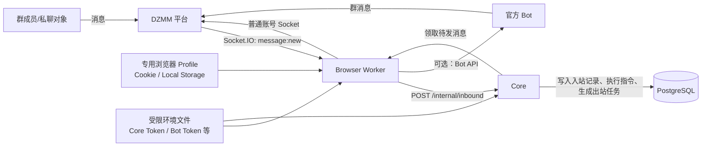

# DZMM 账号连接、登录保存与消息收发接入指南

> 面向第一次接手 DZMM 机器人的同事。读完本文，应能知道：需要准备什么、登录信息放在哪里、系统怎样实时收到消息、怎样安全发消息，以及消息不工作时先查哪里。
>
> 本文以当前仓库实现为准（2026-09-10）。所有 `<...>` 都是占位符，**绝不能替换成真实 Token、Cookie、密码、群聊 ID 或用户 ID 后提交到仓库、发到群里或写进工单。**

## 1. 先记住这四件事

1. **普通 DZMM 账号**负责登录网页、实时收消息、发送普通消息、私聊、图片、分享消息与撤回。
2. **官方 Bot**是可选的独立身份，当前优先承担群消息发送；它不代替普通账号登录，也不能替代私聊通道。
3. **浏览器 Profile（用户数据目录）才是普通账号登录态的保存位置。** Cookie、Local Storage 和网站缓存都在里面；不要把它们复制到代码或数据库里。
4. **Core 不直接连接 DZMM。** Browser Worker 负责平台连接，把收到的消息交给 Core；Core 决定业务回复，再把待发消息交回 Worker。

一句话概括：

```text
专用 DZMM 账号登录浏览器
→ 浏览器 Worker 取得临时 Token 并连接 Socket
→ 收到群/私聊消息
→ 交给 Core 执行业务
→ Core 生成待发消息
→ Worker 用官方 Bot 或普通账号发回平台
```

## 2. 名词表：不要把它们混在一起

| 名称 | 它是什么 | 保存在哪里 | 能做什么 |
| --- | --- | --- | --- |
| 普通账号 | 一个正常 DZMM 用户账号 | 专用浏览器 Profile | 登录、收群消息、收已可访问私聊、普通消息/图片/分享/撤回 |
| 浏览器 Profile | Chromium 的持久化用户目录 | 服务器受限目录，例如 `/var/lib/dzmm-browser/profile` | 保存登录 Cookie、Local Storage、浏览器会话 |
| Access Token | 网页在连接 Socket 前取到的短期凭据 | 运行内存；不应手工长期保存 | Socket.IO 鉴权 |
| Cookie | 网站登录会话凭据 | 浏览器 Profile | 辅助网页请求与 Socket 握手 |
| 官方 Bot | 平台创建的独立 Bot 身份 | 平台后台 + Bot API Token | 群内 Bot 消息发送 |
| Bot API Token | 官方 Bot 的密钥 | 服务器受限环境文件 | 调用 Bot 发送接口 |
| Core Token | Worker 调用本机 Core 内部接口的密钥 | 服务器受限环境文件 | Worker 与 Core 互认 |
| 群聊 `chatroomId` | DZMM 上一个具体群的唯一 ID | Core 的群聊配置 | 指定收发到哪个群 |

### 最常见的误解

- **“我有 Bot Token，是否就不用登录普通账号？”** 不行。现有入站监听、私聊、撤回和图片/分享都依赖普通账号浏览器通道。
- **“能把网页 Token 写进 `.env` 吗？”** 不建议。它是短期 Token，会失效；系统会在每次 Socket 建连时从已登录网页获取。
- **“Cookie 放进数据库方便吗？”** 不可以。Cookie 是账号凭据，应只保留在受限浏览器 Profile 中。
- **“Bot 和普通账号是同一个身份吗？”** 不是。Bot 必须单独创建并添加进目标群。

## 3. 系统结构图



### 各模块职责

| 模块 | 不应该做什么 | 当前代码入口 |
| --- | --- | --- |
| BrowserSession | 不处理游戏、经济、指令规则 | `src/dzmm_bot/browser/session.py` |
| AikdaSocketGateway | 不决定“某条指令是否允许” | `src/dzmm_bot/browser/aikda_socket.py` |
| BrowserWorker | 不把业务规则写进平台收发逻辑 | `src/dzmm_bot/browser/worker.py` |
| Core | 不保存 DZMM Cookie，不直接操控网页 | `src/dzmm_bot/core/` |
| 官方 Bot 客户端 | 不读取私聊，不冒充普通账号 | `src/dzmm_bot/browser/bot_api.py` |

## 4. 接手前要准备的东西

### 4.1 平台侧

- 一个专门给机器人使用的 DZMM 普通账号；不要使用运营人员日常个人账号。
- 该账号已加入需要监听的每个群，且在群内有发送消息的权限。
- 若要启用官方 Bot：已创建 Bot、已保管 Bot API Token、已将 Bot 加入需要由 Bot 发言的群。
- 若需要私聊能力：普通账号必须已经能访问对应的一对一私聊。系统不能凭一个用户 ID 凭空创建私聊。

### 4.2 服务器侧

- 一台可运行 Chromium/Playwright、Python 服务和 PostgreSQL 的机器。
- 给浏览器 Profile 一个仅服务账户可读写的持久化目录。
- 一个只允许管理员读取的环境文件，例如 `/etc/dzmm/dzmm.env`，权限建议为 `600`。
- 已部署并启动 Core、管理端、Browser Worker 等 systemd 服务。

### 4.3 绝不应该交接的内容

不要在本文、Git、截图、聊天记录、浏览器书签同步或测试代码中保存：

```text
账号密码
Cookie 原文
/api/auth/token 返回的 access_token
DZMM_BOT_API_TOKEN
DZMM_CORE_TOKEN
DZMM_ADMIN_TOKEN
数据库 URL 中的密码
```

如果这些内容曾经外泄，应按“凭据已泄露”处理：修改密码、重新登录、轮换 Token，而不是只删除聊天消息。

## 5. 配置：哪些值放在哪里

### 5.1 生产环境文件示例

下面只展示变量名称和格式。真实值只放服务器受限文件，不提交仓库。

```dotenv
# Core / 数据库
DZMM_DATABASE_URL=postgresql+psycopg://<user>:<password>@127.0.0.1/dzmm
DZMM_CORE_TOKEN=<random-secret>
DZMM_ADMIN_TOKEN=<random-secret>

# 普通账号浏览器通道
DZMM_BROWSER_PROFILE=/var/lib/dzmm-browser/profile
DZMM_LOGIN_URL=https://www.ivorune.xyz/sign-in
DZMM_CHAT_URL=https://www.ivorune.xyz/chat?c=<INITIAL_GROUP_CHATROOM_ID>
DZMM_BROWSER_CDP_PORT=19222

# 可选：官方 Bot 群消息通道
DZMM_BOT_API_TOKEN=<bot-api-token>
DZMM_BOT_ID=<bot-id>

# Worker 并发上限（1 到 16）
DZMM_OUTBOUND_CONCURRENCY=4
```

变量定义以 `deploy/env/dzmm.example.env` 和 `src/dzmm_bot/runtime/settings.py` 为准。

### 5.2 每个值的作用

| 变量 | 是否必填 | 用途 | 常见错误 |
| --- | --- | --- | --- |
| `DZMM_BROWSER_PROFILE` | 是 | 保存普通账号登录态 | 指向临时目录，重启后登录丢失；与真人浏览器共用 |
| `DZMM_LOGIN_URL` | 是 | 未登录时打开的登录页 | 仍填旧域名或错误环境 |
| `DZMM_CHAT_URL` | 是 | Socket 初始群与平台域名来源 | 没有 `?c=<chatroomId>` |
| `DZMM_CORE_TOKEN` | 是 | Worker 调用本机 Core | 两端值不一致，入站/出站都失败 |
| `DZMM_BOT_API_TOKEN` | 否 | 官方 Bot 发群消息 | Token 轮换后没同步重启 Worker |
| `DZMM_BOT_ID` | 仅后台“添加 Bot”需要 | 将当前 Bot 添加到群 | 误填普通账号 ID |

### 5.3 多群聊怎么配置

不要通过复制多个 Worker 进程来监听多个群。当前设计是：

1. 管理后台把群添加到 `group_chats`；
2. Browser Worker 每约 5 秒向 Core 同步一次当前启用群；
3. Worker 对每个启用群调用 `message:join-room`；
4. 所有群共享员工、货币、档案等数据，但每个群的游戏状态独立。

`DZMM_CHAT_URL` 仍保留为初始连接和域名来源；实际监听群列表以后台配置为准。

## 6. 第一次登录：正确做法

### 6.1 登录步骤

1. 确认 `DZMM_BROWSER_PROFILE` 是新建或已授权的专用目录。
2. 启动 Browser Worker；它会启动或接管专用 Chromium。
3. 在管理后台点击“开始人工登录”，通过提供的桌面/noVNC 完成**一次真人登录和可能的人机验证**。
4. 登录后进入任意已配置群，确认普通账号能看见群消息并能手工发一条测试消息。
5. 回到管理后台确认 Browser Worker 是 `Ready/active`，然后做第 11 节的收发验收。

### 6.2 登录信息实际上怎样保存

系统不会把密码、Cookie 或 Access Token 写入 PostgreSQL。

```text
人工登录成功
→ 网站将会话资料写进 Chromium Profile
→ Profile 保存在 DZMM_BROWSER_PROFILE
→ Worker 下次启动仍使用同一 Profile
→ 需要 Socket 时，浏览器页面请求 /api/auth/token
→ 拿到短期 access_token 后发起 Socket 连接
```

`BrowserSession` 也可从已保存的认证 Cookie 中读取会话资料，作为网页请求暂时不可用时的有限兜底；这仍然是在浏览器 Profile 内部读取，并不是将 Token 长期转存到应用数据库。

### 6.3 何时必须重新人工登录

- 浏览器跳回登录页；
- `/api/auth/token` 返回 401/403；
- 平台出现人机验证或要求重新验证；
- 账号被退出、改密、冻结，或网站域名变更导致 Cookie 不再匹配；
- Profile 被删除、损坏或换机器后没有安全迁移。

不要通过在环境变量硬塞旧 Cookie/旧 Token 来“修复”，通常只会得到更难排查的间歇性错误。

## 7. 接收消息：Socket 是主通道

### 7.1 Socket 连接过程

普通账号已登录后，`AikdaSocketGateway` 会：

```text
1. 调用 user.getMe，确认当前普通账号是谁
2. 在网页上下文请求 /api/auth/token，取得短期 Token
3. 读取当前站点 Cookie
4. 连接 Socket.IO：<站点域名>，路径 /ws/matching
5. 带上 auth.token 与 Cookie
6. 对每个启用群发送 message:join-room
7. 监听 message:new
```

这不是“轮询网页 DOM”。正常实时消息来自 Socket 事件。

### 7.2 平台事件形状

平台推送的新消息会被解析为类似结构：

```json
{
  "chatroomId": "<chatroom-id>",
  "message": {
    "message_id": "<platform-message-id>",
    "sent_by": "<platform-user-id>",
    "chatroom_id": "<chatroom-id>",
    "sent_at": "<ISO-8601-time>",
    "content": {
      "type": "text",
      "text": "/打卡"
    }
  }
}
```

注意：这只是**结构示例**，不要捏造或发送这类消息来伪造用户身份。

### 7.3 哪些入站消息会被接收

目前 Gateway 会拒绝：

- 普通账号自己发送的消息（防止机器人对自己再触发）；
- 缺少消息 ID、发送者 ID、时间或合法内容结构的事件；
- 不是文本或图片的内容类型；
- 图片 URL 不合法的事件；
- 相同 `chatroomId + message_id` 的重复事件。

收到后，Worker 把消息异步提交到 Core：

```http
POST /internal/inbound
X-Core-Token: <DZMM_CORE_TOKEN>
```

Core 再以平台消息 ID 做持久化幂等，写入 `inbound_messages`，然后执行指令、AI 或其他业务。

### 7.4 私聊为什么容易和群聊不同

私聊不是“知道用户 ID 就能发”。平台必须先让普通账号拥有该一对一房间的访问权。Worker 会维护 Core 允许的私聊房间列表：

- 已建立且系统已登记的私聊：所有正常消息可进入；
- 未登记的新私聊：只有少量“入口指令”（如暗网、投稿、公演预约等）会先进入，随后登记该房间；
- 不在入口列表、也不在已登记列表的未知私聊：会被忽略，避免陌生房间大量内容堵塞处理。

因此，排查“群里正常、某人私聊不回”时，先检查该私聊房间是否已建立并登记，而不是先怀疑群聊 Socket。

### 7.5 当前的恢复策略

当前运行策略以 Socket 实时事件为主：Socket 断开时会重新获取 Token 并重连已配置群和活动私聊房间。不要假定系统持续调用历史消息接口做补拉；平台限流或人机验证时，额外历史接口调用反而可能带来风险。

这意味着：消息漏失时，优先检查 Socket 连接、`message:join-room`、Worker 心跳和 `inbound_messages`；不能依赖“稍后必定从历史接口补回来”。

## 8. 发送消息：先进入 Core 队列，再由 Worker 发出

### 8.1 为什么不能在业务代码里直接调用 Socket

直接发送容易造成：多玩法抢同一连接、重复重试、消息乱序、频率超限，且数据库不知道这条消息是否真的发出。

正确流程是：

```text
业务逻辑生成回复
→ Core 写入 outbound_messages（待发送）
→ Browser Worker 领取租约
→ 按目标会话串行/限速发送
→ 平台成功 ACK 后回写已发送与 platform_sent_id
```

若改新玩法，应复用 Core 的出站队列，不要在玩法逻辑中直接 `gateway.send(...)`。

### 8.2 普通账号 Socket 发送

普通文本发送使用：

```text
message:join-room({ chatroomId })
→ message:send({ chatroomId, message })
→ 等待 ACK: { success: true }
```

发送结构的关键字段：

```json
{
  "chatroomId": "<target-room>",
  "message": {
    "message_id": "<new-uuid>",
    "sent_by": "<currently-logged-in-account-id>",
    "chatroom_id": "<target-room>",
    "sent_at": "<utc-time>",
    "content": { "type": "text", "text": "<reply>" }
  }
}
```

每个目标房间都有独立发送锁，避免同一私聊/群的两条消息并发抢顺序。需要回复定位时，`content.reference` 附带原消息元数据。

### 8.3 当前发送路由

| 要发什么 | 默认通道 | 备注 |
| --- | --- | --- |
| 普通群文本，且已配置官方 Bot | 官方 Bot API 优先 | Bot 失败后才尝试普通账号 Socket |
| 普通群文本，未配置 Bot | 普通账号 Socket | 受平台普通账号限制与限流影响 |
| 私聊文本 | 普通账号 Socket | Bot 不处理私聊 |
| 需要撤回的消息 | 普通账号 Socket | 只有普通账号可走 `message:recall` |
| 图片 | 普通账号 Socket + 上传接口 | 不能用纯文本 Bot API 替代 |
| 小说/故事集分享 | 普通账号 Socket，`content.type = share` | 当前使用 `shareType = novel` |

### 8.4 官方 Bot API

当前客户端请求：

```http
POST https://www.ivorune.xyz/api/bot/send-message
X-Bot-Token: <DZMM_BOT_API_TOKEN>
Content-Type: application/json

{
  "chatroom_id": "<target-room>",
  "content": "<text>"
}
```

成功条件必须同时满足：HTTP 200、响应 `ok == true`，并返回非空 `result.message_id`。

如果平台返回 `bot is not installed`，正确做法是把 Bot 添加到**该目标群**；不要反复换 Token。

### 8.5 限流、重复内容与失败的正确处理

普通账号有发送频率、重复内容、长度和换行限制。Worker 已做三层保护：

- 私聊发送间隔；
- 普通账号令牌桶；
- 遇到“请稍后再试”时进入约 60 秒冷却并释放出站任务，之后再由队列重试。

重要原则：

1. 平台没有明确成功 ACK 时，**不能立即换通道重复发送**，否则可能造成用户看到两条一样的消息。
2. 暗网列表这类失败后不应该无限积压重试的内容，会被标记失败，由业务层给出可理解反馈。
3. 不要用随机前缀、拆分文本或大量并发来“绕过”平台风控；先降低发件速率、减少不必要广播、优先启用 Bot 群通道。

## 9. 其他消息类型

### 9.1 图片

流程：

```text
本地文件
→ 浏览器页面请求 chatroom.uploadImage
→ 获得平台图片 URL
→ Socket 发送 content.type = image
```

上传必须由已登录普通账号浏览器执行。管理员替员工上传档案形象时同样如此。

### 9.2 回复定位

要做“回复某个玩家的原消息”，不是在文本开头手写名字，而是带 `reference`：

```json
{
  "id": "<original-message-id>",
  "sentBy": "<original-sender-platform-id>",
  "content": { "type": "text", "text": "<original-text>" }
}
```

只要没有完整且可信的原消息元数据，就不要伪造回复定位；退化为普通消息即可。

### 9.3 小说/故事集分享

“公司的故事集”不是把小说正文复制进群，而是发送平台分享内容：

```json
{
  "type": "share",
  "shareType": "novel",
  "resourceId": "<novel-id>"
}
```

后台保存小说链接时，业务层需要从链接中提取小说 ID；发送时用这个 ID 作为 `resourceId`。链接域名是否变化由平台决定，接入前应在测试群验证分享卡片能正常打开。

## 10. 数据库里能看到什么，不能看到什么

| 表/记录 | 用途 | 是否含账号密钥 |
| --- | --- | --- |
| `inbound_messages` | 平台消息 ID、发送者平台 ID、内容、来源群/私聊、处理状态 | 否 |
| `outbound_messages` | 待发/已发/失败的回复、目标房间、平台发送 ID | 否 |
| 用户与员工表 | 平台用户 ID、公司展示名、档案等业务数据 | 否（不保存 Cookie/密码） |
| 群聊运行状态 | 每个已配置群的连接、最近入站/出站时间和错误摘要 | 否 |
| 浏览器 Profile | Cookie、Local Storage、浏览器会话 | **是，应受文件权限保护** |
| `/etc/dzmm/dzmm.env` | Core/Bot/数据库等密钥 | **是，应受文件权限保护** |

排查时只查看必要字段。尤其是 `inbound_messages.content` 可能包含玩家私密内容，不能为了调试整表导出或转发。

## 11. 从零验收：接手人必须亲自做一遍

在独立测试群完成以下步骤，再接管正式群。

### 第一步：登录态

- [ ] 打开人工登录桌面，确认专用账号已登录。
- [ ] 重启 Browser Worker 后登录态仍在。
- [ ] 不在终端、日志或截图中展示 Cookie/Token。

### 第二步：群消息接收

- [ ] 测试账号在测试群发送 `/当前游戏` 或一个无副作用指令。
- [ ] Worker 与 Core 都保持 active。
- [ ] 管理端/数据库能看到一条新的 `inbound_messages` 记录。
- [ ] 机器人只回复一次；重复投递同一平台消息 ID 不会重复执行。

### 第三步：群消息发送

- [ ] 发送一条短回复，确认群里能看到。
- [ ] 若已配置官方 Bot，确认发送者是 Bot；若未配置，确认发送者是普通账号。
- [ ] 检查出站状态为已发送且有平台 `message_id`。
- [ ] 连续发多条不应造成无限堆积或同一条重复。

### 第四步：私聊

- [ ] 先确保测试账号已与普通机器人账号建立可访问私聊。
- [ ] 在私聊发送允许的入口指令，例如 `/暗网`。
- [ ] 确认回复仍由普通账号发出，不是官方 Bot。

### 第五步：特殊内容

- [ ] 发送一张图片，确认上传和展示正常。
- [ ] 发送一次故事集分享，确认出现小说卡片。
- [ ] 测试一条需要回复定位的功能，确认引用的是正确原消息。
- [ ] 测试可撤回消息，确认撤回由普通账号完成。

## 12. 故障排查：按这个顺序查

### A. “玩家说了指令，机器人完全没反应”

1. 确认是在后台已启用监听的群里。
2. 查看 Browser Worker 是否 active、账号是否仍登录。
3. 看该群运行状态的“最近入站时间”有没有更新。
4. 查询 `inbound_messages` 是否出现该平台消息。
5. **没有入站记录**：问题在平台事件、Socket 连接、群房间加入或 Worker 前半段；先不要改游戏规则。
6. **有入站记录但无回复**：再查 Core 指令路由、权限、游戏状态和出站任务。
7. **有出站任务但群里没显示**：查 Bot API/普通账号 ACK、限流、重复内容拒绝和 `outbound_messages` 状态。

这能避免把“消息根本没进系统”误修成“参与者权限问题”。

### B. “群里正常，某个人的私聊不回”

1. 确认该私聊是否是普通账号已经存在、可访问的房间。
2. 确认指令是否属于允许的新私聊入口。
3. 检查该私聊的最近发送是否触发频率限制或重复内容限制。
4. 不要让官方 Bot 代替私聊发送。

### C. “Bot 不发，但普通账号会发”

1. 检查 `DZMM_BOT_API_TOKEN` 是否存在且已轮换同步。
2. 检查 Bot 是否在**对应目标群**，不是只在另一个群。
3. 查看 Worker 记录的 Bot API 错误；例如 `captcha_required` 时会暂时回退普通账号。
4. 不要因为一次失败同时手工和程序各发一次，防止重复。

### D. “登录后过一会儿又不读消息”

1. 检查浏览器是否跳回登录/验证页。
2. 确认 `/api/auth/token` 是否还能取得 Token。
3. 检查 Socket 是否连上以及各群 `message:join-room` 状态。
4. 必要时用人工登录完成验证后重启 Worker。

### E. “队列有未发送消息”

先看错误类型：

| 错误/现象 | 应对 |
| --- | --- |
| `请稍后再试` | 等待冷却，让队列按令牌桶继续；不要手动大量重发 |
| `请勿发送重复内容` | 改业务文案或阻止重复触发，不要无限重试 |
| `bot is not installed` | 把 Bot 加到目标群后再测 |
| Socket ACK 超时 | Worker 会请求重连；检查网络与平台 Socket 状态 |
| 指定私聊失败 | 检查该房间是否已建立及是否仍可访问 |

## 13. 常用运维命令

以下命令应在生产服务器执行。命令本身不输出密钥；执行时仍不要把环境文件内容打印到终端或聊天里。

```bash
# 服务状态
sudo systemctl status dzmm-core.service --no-pager
sudo systemctl status dzmm-browser-worker.service --no-pager

# 最近 Worker 日志
sudo journalctl -u dzmm-browser-worker.service -n 100 --no-pager

# 重启浏览器 Worker（修改登录/浏览器相关配置后使用）
sudo systemctl restart dzmm-browser-worker.service

# Core 健康检查（端口以实际配置为准）
curl -fsS http://127.0.0.1:18120/healthz
```

修改 `/etc/dzmm/dzmm.env` 后要重启相应服务。修改代码时，应先跑测试、走标准部署，再重启；不要直接在线编辑运行目录作为常规流程。

## 14. 新功能接入检查表

任何新增“发消息/收消息”功能，提交前逐项回答：

- [ ] 是群功能、私聊功能，还是两者都支持？
- [ ] 群消息是否通过 Core 出站队列？
- [ ] 私聊是否只向已建立或明确入口允许的房间发送？
- [ ] 是否需要回复定位？若需要，原消息元数据从哪里来？
- [ ] 是否需要图片、分享或撤回？这决定不能简单改用 Bot API。
- [ ] Bot 未安装、Bot API 拒绝、Socket ACK 超时分别怎么记录和处理？
- [ ] 同一平台消息重投时会不会重复扣币、重复开局或重复发奖？
- [ ] 是否已在测试群做“成功一次、失败一次、重复一次”的测试？

## 15. 交接完成标准

接手人可以独立完成以下事情，才算真正接通：

- [ ] 能解释普通账号、浏览器 Profile、短期 Token、Cookie、官方 Bot 的区别。
- [ ] 能安全完成一次人工登录，不泄露账号凭据。
- [ ] 能在后台新增群并确认其 Socket 运行状态。
- [ ] 能用测试群验证入站、群出站、私聊、图片/分享与撤回。
- [ ] 能依据“入站记录 → Core → 出站记录 → 平台 ACK”的链路定位故障。
- [ ] 知道不能用伪造 `sent_by`、篡改 Cookie、无限重试或并发轰炸来解决平台限制。

## 16. 代码索引

| 文件 | 什么时候看它 |
| --- | --- |
| `src/dzmm_bot/runtime/settings.py` | 不清楚某环境变量从哪读取时 |
| `src/dzmm_bot/browser/session.py` | 不清楚登录态、Cookie、网页 Token 怎么取得时 |
| `src/dzmm_bot/browser/aikda_socket.py` | 不清楚 Socket 连法、收发 payload、群/私聊加入时 |
| `src/dzmm_bot/browser/worker.py` | 不清楚入站过滤、队列、发送路由与限流时 |
| `src/dzmm_bot/browser/bot_api.py` | 不清楚官方 Bot API 请求格式时 |
| `src/dzmm_bot/browser/core_client.py` | 不清楚 Worker 怎样调用 Core 时 |
| `src/dzmm_bot/core/` | 不清楚指令、游戏、经济等业务处理时 |
| `tests/browser/` | 修改平台连接层前，先看和补充测试时 |

旧的消息通道交接资料见 [BOT_MESSAGE_TRANSPORT_HANDOFF.md](BOT_MESSAGE_TRANSPORT_HANDOFF.md)。若两份文字描述不一致，以当前代码与本文“Socket 主通道、Core 队列、官方 Bot 优先群消息”的说明为准，并在修改实现后同步更新文档。
