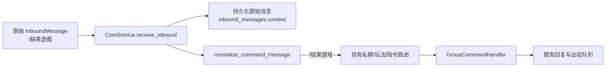

# 简繁中文指令互通设计

## 目标

让玩家使用现有所有斜杠指令的简体或繁体写法时，进入同一套既有业务逻辑；机器人回复、帮助文案和指令参数继续使用现有简体中文规范。

示例：

```text
/加入、/加入（繁体相同）        → /加入
/餘額                          → /余额
/結束遊戲                      → /结束游戏
/德州撲克                      → /德州扑克
/購買 1                        → /购买 1
/發獎金 全部 10                → /发奖金 全部 10
```

最后一行中仅 `/發獎金` 被转换；`全部 10` 保持原样，不增加繁体参数、英文、日文或自然语言意图识别。

## 非目标

- 不按玩家语言翻译回复、帮助、后台或 AI 内容。
- 不转换员工名称、部门名称、商品名称、角色名、答案、档案或任何参数文本。
- 不支持英文、日文、自然语言描述，或不带 `/` 的指令表达。
- 不修改数据库表、历史入站内容、命令开关存储值或既有命令模板键。
- 不改变平台 Socket、登录、发送或消息队列行为。

## 当前问题

当前指令处理把 `message.content` 按空格拆分后直接与简体命令常量比较。这个比较同时出现于 Core 的私聊入口、随机事件/公演拦截、游戏冲突识别和 `GroupCommandHandler`。因此 `/結束遊戲` 等繁体命令无法进入现有 `/结束游戏` 流程。

简单地只在 `GroupCommandHandler` 内替换命令不够：较早的私聊入口和玩法阶段判断会先把它忽略或拦截。

## 方案选择

采用“命令首词归一化”方案：

1. 新增一个独立的命令归一化模块。
2. 只处理以半角 `/` 开始、直到第一个空白字符之前的首词。
3. 使用 OpenCC 的 `t2s` 转换器把繁体首词转换为简体。
4. 将少量并非纯简繁对应的既有兼容词形再映射为系统规范命令，例如 `/登入暗網` 映射到现有 `/登录暗网`，再由既有暗网别名规则处理。
5. 如果转换结果不是已注册命令，保留原首词，不把普通聊天误判为命令。
6. 用归一化副本执行路由；原始 `InboundMessage` 仍用于持久化与记忆/审计。

选择 OpenCC 而不手写全量繁体表，原因是当前约一百余条命令会持续增加；OpenCC 可自动为新增的简体命令提供常规繁体匹配，例外词形仅保留很小的显式表。

## 架构与数据流



### 新模块

新模块 `src/dzmm_bot/core/command_localization.py` 提供：

```python
def normalize_command_content(content: str) -> str:
    """仅在已知简繁命令别名匹配时替换首词；其余内容原样返回。"""

def normalize_command_message(message: InboundMessage) -> InboundMessage:
    """返回保留全部元数据、仅可能替换 content 首词的副本。"""
```

模块维护：

- `CANONICAL_COMMANDS`：从当前规范命令集导入或由调用方显式提供的简体命令集合；
- OpenCC `t2s` 转换；
- `EXTRA_COMMAND_ALIASES`：只有无法通过 `t2s` 得到系统规范命令的固定词形；
- 原始空白和参数后缀。首词替换时不得重排、翻译或清理参数。

命令集合必须由单一来源导出，避免 `_COMMANDS`、私聊入口、游戏命令表分别维护简繁别名。

### CoreService 的改动

`CoreService.receive_inbound` 将保留两个变量：

- `message`：原始消息，仅用于 `accept_inbound`、活动/记忆记录、AI 提及解析和原文相关业务；
- `routed_message`：`normalize_command_message(message)` 的副本，仅用于所有命令判断、玩法阶段判定和 `CommandHandler.handle`。

所有当前在 `CoreService` 中读取命令首词的地方都必须读取 `routed_message.content`，包括：

- `/甩锅` 的玩法锁；
- 投稿命令识别；
- 私聊草稿控制命令与 `_DIRECT_COMMANDS`；
- 公演阶段允许的 `/end`、`/打赏`；
- 随机事件独立命令、董事会 `/结束游戏` 特判与事件拦截；
- 最终 `GroupCommandHandler.handle(routed_message)`。

`GroupCommandHandler` 可继续保持既有简体命令比较，不应重复进行 OpenCC 转换。

### 命令定义、帮助与管理后台

数据库和后台仍以简体规范命令为唯一键：例如 `/余额` 的启用状态同时控制 `/餘額`。帮助卡继续展示简体命令，不新增语言选择器。

## 依赖

在 `pyproject.toml` 增加 `opencc-python-reimplemented`。这是纯 Python 的 OpenCC 兼容实现；运行时只加载 `t2s`。不调用在线翻译服务，不增加外部网络请求。

## 边界行为

| 输入 | 执行内容 | 原因 |
| --- | --- | --- |
| `/餘額` | `/余额` | 首词是现有命令的繁体等价写法 |
| `/購買 1` | `/购买 1` | 只替换首词，数字参数不变 |
| `/發獎金 全部 10` | `/发奖金 全部 10` | 只处理命令名，不转换 `全部` |
| `/發獎金 全部 十` | `/发奖金 全部 十` | 参数仍由既有金额验证拒绝 |
| `/登入暗網` | `/登录暗网` | 显式例外词形，随后复用既有暗网别名 |
| `/不存在指令 測試` | 原样 | 未知命令不应被臆测转换或触发业务 |
| `餘額` | 原样 | 没有 `/`，不是命令 |
| `/餘額小明` | 原样 | 整个首词不是已知命令，避免把名称/文本截断 |
| `/結束遊戲` | `/结束游戏` | 在玩法状态与权限判断前已归一化 |

## 错误处理与可观测性

- OpenCC 初始化或转换出现不可预期异常时，应用启动应失败，不允许悄悄只让部分繁体命令失效。
- 归一化不记录玩家参数或个人内容；若需要调试，只记录规范命令名和原首词，且仅在现有安全日志策略允许时启用。
- 已持久化的 `inbound_messages.content` 必须保持玩家输入原文，以便审计“玩家实际发了什么”。

## 测试策略

1. `tests/core/test_command_localization.py`
   - 简体命令不变；
   - 每个规范命令的 OpenCC 繁体写法能回到原简体命令；
   - `/登入暗網` 等例外词形正确映射；
   - 参数、空白、未知命令和非命令消息保持原样；
   - `normalize_command_message` 仅替换 `content`，其他元数据不变。
2. `tests/core/test_service.py`
   - 繁体私聊入口命令能通过 `_DIRECT_COMMANDS` 并调用命令处理器；
   - 繁体玩法阶段命令能按已有简体规则允许或拦截；
   - 入站存储仍保存繁体原文，而处理器看到简体规范命令。
3. 现有命令和游戏测试全量运行，确保简体行为完全不变。

## 验收标准

- 所有当前简体斜杠命令都有对应的繁体输入形式并执行相同业务。
- `/購買 1` 与 `/购买 1` 结果一致；参数不被转换。
- `/結束遊戲` 在活动游戏中走与 `/结束游戏` 相同的权限与结束逻辑。
- 命令开关只需配置简体命令，繁体别名自动受同一开关控制。
- 入站数据库仍可看到玩家原始繁体输入。
- 不引入英文、日文、自然语言意图或回复本地化。
